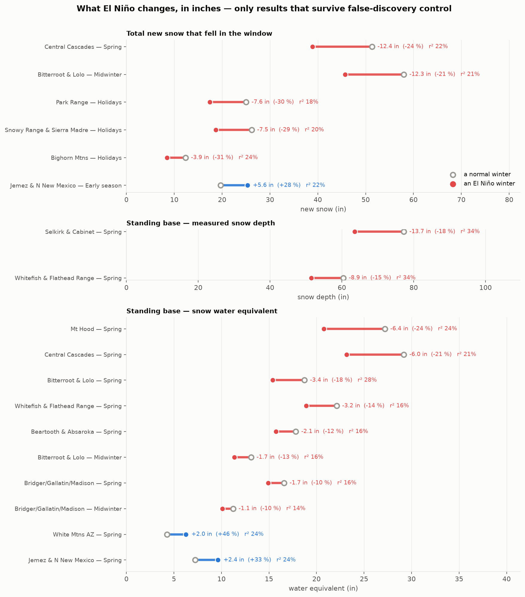
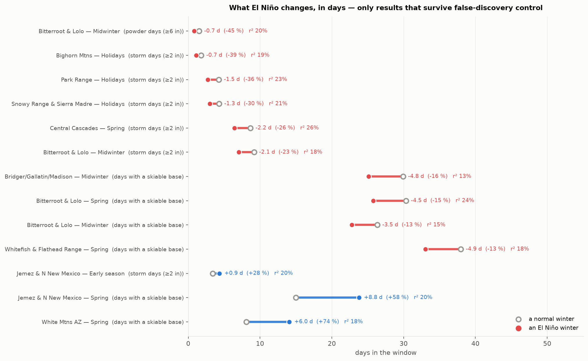

# El Niño and the ski season — the western United States

**Does El Niño affect the ski season, where, and when in the winter?**
NOAA's Oceanic Niño Index against NRCS SNOTEL snowpack for 37 ski regions
across every SNOTEL state, reported in powder days and inches.

_Last updated 2026-09-20. Real data: 932 SNOTEL stations,
40.2 million daily observations, water years 1964–2026, {25 El Niño, 27 La Niña,
25 neutral} winters._

This is not a water-supply study. April-1 snow-water equivalent is a runoff
metric. A skier cares how often it snows six inches and how deep the base is
in the windows that carry a season, so that is what is measured.

---

## What actually survives

31 of 806 tests clear Benjamini-Hochberg false-discovery control across the
whole grid. Everything below that is context; this is the result.

### In inches

| Ski region | Window | Measure | winters | a normal winter | an El Niño winter | difference | r² |
|---|---|---|---|---|---|---|---|
| Bighorn Mtns | Holidays | Total new snow | 48 | 12.3 in | **8.5 in** | **-3.9 in** (-31 %) | 24% |
| Park Range (Steamboat) | Holidays | Total new snow | 47 | 25.0 in | **17.4 in** | **-7.6 in** (-30 %) | 18% |
| Snowy Range & Sierra Madre | Holidays | Total new snow | 46 | 26.2 in | **18.7 in** | **-7.5 in** (-29 %) | 20% |
| Central Cascades (Stevens/Snoqualmie) | Spring | Total new snow | 45 | 51.3 in | **38.9 in** | **-12.4 in** (-24 %) | 22% |
| Mt Hood | Spring | Base, water equivalent | 48 | 27.2 in | **20.8 in** | **-6.4 in** (-24 %) | 24% |
| Bitterroot & Lolo (Montana Snowbowl) | Midwinter | Total new snow | 59 | 58.0 in | **45.7 in** | **-12.3 in** (-21 %) | 21% |
| Central Cascades (Stevens/Snoqualmie) | Spring | Base, water equivalent | 45 | 29.2 in | **23.2 in** | **-6.0 in** (-21 %) | 21% |
| Bitterroot & Lolo (Montana Snowbowl) | Spring | Base, water equivalent | 59 | 18.7 in | **15.4 in** | **-3.4 in** (-18 %) | 28% |
| Selkirk & Cabinet (Schweitzer/Silver) | Spring | Base, snow depth | 25 | 77.3 in | **63.5 in** | **-13.7 in** (-18 %) | 34% |
| Whitefish & Flathead Range | Spring | Base, snow depth | 25 | 60.4 in | **51.5 in** | **-8.9 in** (-15 %) | 34% |
| Whitefish & Flathead Range | Spring | Base, water equivalent | 52 | 22.1 in | **18.9 in** | **-3.2 in** (-14 %) | 16% |
| Bitterroot & Lolo (Montana Snowbowl) | Midwinter | Base, water equivalent | 59 | 13.1 in | **11.4 in** | **-1.7 in** (-13 %) | 16% |
| Beartooth & Absaroka (Red Lodge) | Spring | Base, water equivalent | 53 | 17.8 in | **15.7 in** | **-2.1 in** (-12 %) | 16% |
| Bridger/Gallatin/Madison (Big Sky) | Spring | Base, water equivalent | 60 | 16.6 in | **14.9 in** | **-1.7 in** (-10 %) | 16% |
| Bridger/Gallatin/Madison (Big Sky) | Midwinter | Base, water equivalent | 60 | 11.2 in | **10.1 in** | **-1.1 in** (-10 %) | 14% |
| Jemez & N New Mexico | Early season | Total new snow | 46 | 19.7 in | **25.3 in** | **+5.6 in** (+28 %) | 22% |
| Jemez & N New Mexico | Spring | Base, water equivalent | 46 | 7.2 in | **9.6 in** | **+2.4 in** (+33 %) | 24% |
| White Mtns AZ (Sunrise Park) | Spring | Base, water equivalent | 46 | 4.3 in | **6.3 in** | **+2.0 in** (+46 %) | 24% |



### In days

| Ski region | Window | Measure | winters | a normal winter | an El Niño winter | difference | r² |
|---|---|---|---|---|---|---|---|
| Bitterroot & Lolo (Montana Snowbowl) | Midwinter | Powder days (≥6 in) | 59 | 1.5 d | **0.8 d** | **-0.7 d** (-45 %) | 20% |
| Bighorn Mtns | Holidays | Storm days (≥2 in) | 48 | 1.8 d | **1.1 d** | **-0.7 d** (-39 %) | 19% |
| Park Range (Steamboat) | Holidays | Storm days (≥2 in) | 47 | 4.3 d | **2.7 d** | **-1.5 d** (-36 %) | 23% |
| Snowy Range & Sierra Madre | Holidays | Storm days (≥2 in) | 46 | 4.3 d | **3.0 d** | **-1.3 d** (-30 %) | 21% |
| Central Cascades (Stevens/Snoqualmie) | Spring | Storm days (≥2 in) | 45 | 8.7 d | **6.4 d** | **-2.2 d** (-26 %) | 26% |
| Bitterroot & Lolo (Montana Snowbowl) | Midwinter | Storm days (≥2 in) | 59 | 9.2 d | **7.1 d** | **-2.1 d** (-23 %) | 18% |
| Bridger/Gallatin/Madison (Big Sky) | Midwinter | Days with a skiable base | 60 | 29.9 d | **25.1 d** | **-4.8 d** (-16 %) | 13% |
| Bitterroot & Lolo (Montana Snowbowl) | Spring | Days with a skiable base | 59 | 30.3 d | **25.8 d** | **-4.5 d** (-15 %) | 24% |
| Bitterroot & Lolo (Montana Snowbowl) | Midwinter | Days with a skiable base | 59 | 26.3 d | **22.8 d** | **-3.5 d** (-13 %) | 15% |
| Whitefish & Flathead Range | Spring | Days with a skiable base | 52 | 38.0 d | **33.0 d** | **-4.9 d** (-13 %) | 18% |
| Jemez & N New Mexico | Early season | Storm days (≥2 in) | 46 | 3.4 d | **4.3 d** | **+0.9 d** (+28 %) | 20% |
| Jemez & N New Mexico | Spring | Days with a skiable base | 46 | 15.0 d | **23.8 d** | **+8.8 d** (+58 %) | 20% |
| White Mtns AZ (Sunrise Park) | Spring | Days with a skiable base | 46 | 8.1 d | **14.1 d** | **+6.0 d** (+74 %) | 18% |



### Reading it

Fourteen regions never appear above. For most of the West — the Wasatch, the
I-70 corridor, Tahoe, the San Juans, Sun Valley — **El Niño has no effect on
the ski season that can be told apart from chance.** The signal is confined to
the northern Rockies and the Cascades, where it costs roughly a foot of snow
and a couple of storm days, and to northern New Mexico and Arizona, where it
adds snow in spring.

The largest single effect is **Montana Snowbowl in midwinter: 12 inches less
new snow, 2 fewer storm days, and 45 % fewer powder days.** The largest gain
is **northern New Mexico in spring: 9 more days with a skiable base.**

### And strength still does not matter

| Phase and strength | winters | powder days (midwinter) |
|---|---|---|
| La Niña strong | 6 | 1.59 |
| La Niña moderate | 5 | 1.30 |
| La Niña weak | 10 | 1.32 |
| Neutral neutral | 18 | 1.30 |
| El Niño weak | 9 | 1.16 |
| El Niño moderate | 4 | 1.15 |
| El Niño strong | 4 | 1.04 |
| El Niño very strong | 3 | 1.37 |

| Window | r² from phase alone | r² from the continuous ONI | change from adding strength | tests where strength helps | r² within El Niño winters only |
|---|---|---|---|---|---|
| Early season | 6.1% | 4.0% | **-2.1%** | 18 of 198 | 4.6% |
| Holidays | 7.4% | 5.0% | **-2.4%** | 8 of 201 | 7.0% |
| Midwinter | 6.8% | 5.4% | **-1.3%** | 33 of 203 | 7.2% |
| Spring | 9.7% | 6.4% | **-3.3%** | 28 of 204 | 7.2% |

The bars do not descend: a very strong El Niño has more powder days than a
strong one. Knowing the phase beats knowing the index value, and adding
magnitude makes the prediction worse in every window.

---

## Figures

Every figure is about the snowpack as a skier meets it, in days and inches.
The water-supply figures (April-1 scatter, phase boxes, statewide
precipitation) were deleted: they answer a different question.

| File | What it shows |
|---|---|
| `results/fig_significant_inches.png` | **Only the results that survive false-discovery control, in inches.** |
| `results/fig_significant_days.png` | **The same, counted in days.** |
| `results/fig_powder_days.png` | Powder days in a normal winter against an El Niño winter, every region, in days. |
| `results/fig_window_change.png` | Change by window of winter, split at the ENSO node — the holiday anomaly. |
| `results/fig_region_map.png` | The seesaw geographically, as a percentage change. |
| `results/fig_season_shape.png` | How the base builds through the winter by phase, in inches. |
| `results/fig_strength_powder.png` | Powder days by ENSO strength bin: the bars do not descend. |
| `results/fig9_ski_region_window.png` | r² by region x window x measure. |
| `results/fig10_distributions.png` | The probability distributions behind each headline result. |
| `results/fig8_daily_enso_curve.png` | The correlation for every day of the water year. |

**Colour convention everywhere: red means less snow, blue means more.**

---

## How a powder day is defined

A fixed water threshold is a maritime yardstick. Cascade new snow runs about
12 % density and Colorado's about 7 %, so 25 mm of water is roughly 8 inches
of Cascade snow but 14 inches of Colorado snow — counting water alone makes
the driest, lightest snowpacks look storm-free. Instead each station's own
**new-snow ratio** (inches of snow per inch of water) is measured from the
overlap of its depth and water records, then applied to its much longer water
record. Across 508 stations the median ratio is 7.5. A powder day is then
**6 inches of new snow**, and a storm day 2 inches, anywhere.

## Regions, and why they are not states

A state boundary is not a snow boundary. Tahoe spans California and Nevada;
the Bitterroots and Selkirks span Montana and Idaho; the Tetons span Wyoming
and Idaho; the Sangre de Cristo spans Colorado and New Mexico. Each region is
anchored on a mountain range around real ski terrain, carries the states it
actually touches, and is labelled with its snow climate.

Stations are weighted by a Gaussian on the vertical gap to the served
base-to-summit band (scale 1,200 ft) times one on horizontal distance, so a
valley gauge below the lifts does not speak for a mountain. "Eff." is Kish's
effective station count.

| Ski region | states | climate | served band (ft) | stations | eff. | weighted elev (ft) |
|---|---|---|---|---|---|---|
| Chugach (Alyeska) | AK | maritime | 250–2,750 | 11 | 9.5 | 1,413 |
| North Cascades (Mt Baker) | WA | maritime | 3,500–5,089 | 15 | 11.8 | 4,227 |
| Central Cascades (Stevens/Snoqualmie) | WA | maritime | 3,000–5,845 | 20 | 18.1 | 3,758 |
| S Washington Cascades (Crystal/White Pass) | WA | maritime | 4,400–7,012 | 24 | 19.0 | 4,668 |
| Mt Hood | OR | maritime | 4,500–8,540 | 11 | 9.4 | 4,258 |
| E Cascades rain shadow (Mission Ridge) | WA | transitional | 4,570–6,820 | 7 | 5.9 | 4,744 |
| Central Oregon (Mt Bachelor) | OR | transitional | 6,300–9,065 | 10 | 7.3 | 5,220 |
| Blues & Wallowas (Anthony Lakes) | OR | transitional | 7,100–8,000 | 18 | 13.7 | 5,834 |
| N Sierra / Tahoe (Palisades/Heavenly/Rose) | CA+NV | maritime | 6,200–10,067 | 27 | 25.5 | 7,599 |
| S Sierra (Mammoth/June) | CA | maritime | 7,953–11,053 | 2 | 1.7 | 9,038 |
| Ruby Mtns & NE Nevada | NV | continental | 6,500–10,000 | 11 | 10.0 | 7,866 |
| Spring Mtns (Lee Canyon) | NV | continental | 8,510–11,290 | 4 | 4.0 | 8,723 |
| Selkirk & Cabinet (Schweitzer/Silver) | ID+MT | transitional | 4,000–6,400 | 15 | 13.3 | 5,206 |
| Bitterroot & Lolo (Montana Snowbowl) | MT+ID | transitional | 5,000–7,600 | 13 | 10.9 | 5,978 |
| Whitefish & Flathead Range | MT | transitional | 4,464–6,817 | 12 | 10.9 | 5,442 |
| Bridger/Gallatin/Madison (Big Sky) | MT | continental | 6,400–10,000 | 20 | 17.2 | 7,848 |
| Beartooth & Absaroka (Red Lodge) | MT+WY | continental | 7,016–9,416 | 16 | 14.4 | 8,143 |
| Sawtooth & Smoky (Sun Valley) | ID | intermountain | 5,750–9,150 | 20 | 18.1 | 7,569 |
| W Central Idaho (Brundage/Tamarack) | ID | intermountain | 5,840–7,640 | 11 | 9.5 | 5,962 |
| Tetons (Jackson/Targhee) | WY+ID | intermountain | 6,300–10,450 | 15 | 12.3 | 7,943 |
| Yellowstone & Wind River | WY | continental | 7,000–10,000 | 34 | 29.6 | 8,683 |
| Bighorn Mtns | WY | continental | 7,500–9,500 | 15 | 13.8 | 8,747 |
| Snowy Range & Sierra Madre | WY | continental | 8,798–9,663 | 21 | 19.1 | 9,324 |
| Wasatch (Alta/Snowbird/Park City) | UT | intermountain | 6,800–11,000 | 31 | 27.8 | 8,173 |
| Uinta Mtns | UT | continental | 8,000–11,000 | 30 | 27.9 | 9,345 |
| S Utah (Brian Head/Eagle Point) | UT | continental | 9,600–10,970 | 30 | 25.0 | 9,396 |
| Park Range (Steamboat) | CO | continental | 6,900–10,568 | 18 | 15.9 | 9,367 |
| Front Range (Winter Park/Loveland/A-Basin) | CO | continental | 9,000–13,050 | 27 | 23.6 | 10,314 |
| Gore & Tenmile (Vail/Summit/Copper) | CO | continental | 8,120–12,998 | 24 | 21.8 | 10,417 |
| Elk Mtns (Aspen/Crested Butte) | CO | continental | 7,945–12,162 | 14 | 12.8 | 10,172 |
| San Juans (Telluride/Purgatory/Wolf Ck) | CO | continental | 8,725–13,150 | 27 | 25.5 | 10,495 |
| Sangre de Cristo (Taos/Santa Fe) | NM+CO | continental | 9,200–12,481 | 20 | 17.1 | 10,114 |
| Jemez & N New Mexico | NM | continental | 8,500–11,500 | 9 | 7.5 | 9,473 |
| Sacramento Mtns (Ski Apache) | NM | continental | 9,600–11,500 | 1 | 1.0 | 10,250 |
| San Francisco Peaks (AZ Snowbowl) | AZ | continental | 9,200–11,500 | 8 | 4.8 | 8,429 |
| White Mtns AZ (Sunrise Park) | AZ | continental | 9,200–11,100 | 9 | 8.0 | 8,668 |
| Black Hills (Terry Peak) | SD | continental | 5,800–7,064 | 3 | 2.9 | 6,358 |

The Montana Snowbowl region is anchored on **Stuart Mountain SNOTEL**
(901:MT:SNTL, 7,270 ft, 5.3 km from the area, inside its band), which carries
the highest weight there.

---

## Method

1. **Water year** N runs 1 Oct N-1 to 30 Sep N. Phase from the DJF ONI
   (El Niño at or above +0.5 °C, La Niña at or below −0.5 °C); strength bins
   follow CPC on the winter peak.
2. **Ski windows**: Early season (1 Nov–15 Dec), Holidays (16 Dec–5 Jan),
   Midwinter (6 Jan–28 Feb), Spring (1 Mar–15 Apr). They abut without gaps.
3. **Measures**: powder days and storm days in inches of new snow; days with a
   skiable base; average base as SWE and as depth; total new snow.
4. **Two views of every result.** Physical composites are raw averages by
   phase — what actually happened. The statistical tests use per-station
   detrended z-scores, so a warming trend cannot pose as an ENSO signal.
5. **Significance**: the modified bootstrap of Brown & Harper (2026) — omit a
   random 20 % of winters, refit, repeat 10,000 times, require the 2σ bounds
   to exclude zero. The raw rule fires on about 30 % of pure noise, so a
   calibrated version (σ scaled by the delete-d factor sqrt((n−d)/d) = 2) and
   a permutation p-value are reported alongside. Benjamini-Hochberg
   false-discovery control is applied across all 670 tests.

### Data

| Source | What | Period |
|---|---|---|
| NOAA CPC ONI | 3-month Niño-3.4 SST anomaly | 1950– |
| NRCS SNOTEL | daily SWE, snow depth, precipitation, temperature; 932 stations in 13 states | ~1964– |
| NRCS snow courses | manual April-1 SWE, 1,075 courses | ~1930s– |
| NCEI nClimDiv | statewide monthly precipitation and temperature | 1895– |

## Running it

```
python3 -m pip install -r requirements.txt
python3 -m enso_snowpack fetch      # ~1 h, resumable, caches per station
python3 -m enso_snowpack analyze    # results/summary.md, figures, CSV tables
python3 -m pytest tests -q          # 30 offline tests
```

The daily table is streamed straight to parquet: 40 million rows will not fit
in memory as one frame.

### Layout

```
enso_snowpack/
  ski.py         ski regions x windows — the headline analysis
  figures_ski.py the skier-facing figures, in days and inches
  daily.py       day-by-day correlation through the water year
  bootstrap.py   Brown & Harper subsampling, permutation, FDR control
  analysis.py    water-year metrics and seasonal statistics
  sources.py     parsers for each raw format (pure functions, tested offline)
  fetch.py       downloads, per-station cache, streaming parquet sink
  figures.py     shared style and the statistical figures
  report.py      results/summary.md
  fixture.py     synthetic data with a planted signal, for offline tests
```

## Caveats

- **Snow depth starts around 1993.** The new-snow ratios are calibrated on
  that period and applied to the full water record, which assumes density
  has been stable. Depth-based composites rest on ~25 winters.
- **SNOTEL is not the ski area.** Even with elevation weighting these are
  nearby mountain gauges, and they say nothing about grooming or snowmaking.
- **Overlapping regions** are not fully independent where radii intersect.
- **A powder day at 6 inches is a choice.** Regions with few powder days in
  absolute terms show large percentage swings on small differences.

## Citation

MIT licence. Cite NOAA CPC, NRCS AWDB, NCEI nClimDiv, and Brown & Harper
(2026), *Historical evolution of snowpack capacity to buffer rain-on-snow
runoff in a large Columbia River headwaters basin*, Hydrol. Earth Syst. Sci.
30, 5735–5748, doi:10.5194/hess-30-5735-2026, for the bootstrap.
