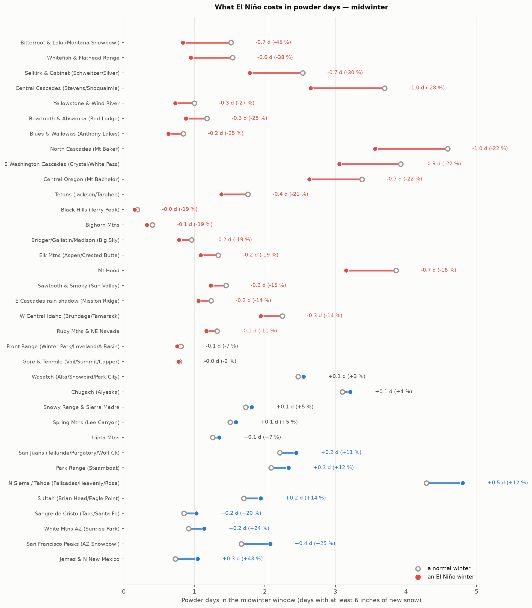
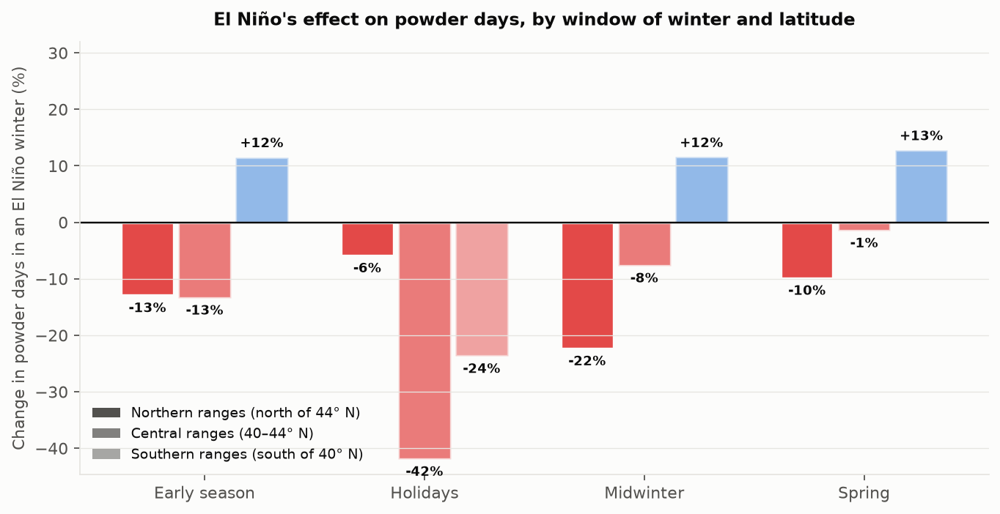
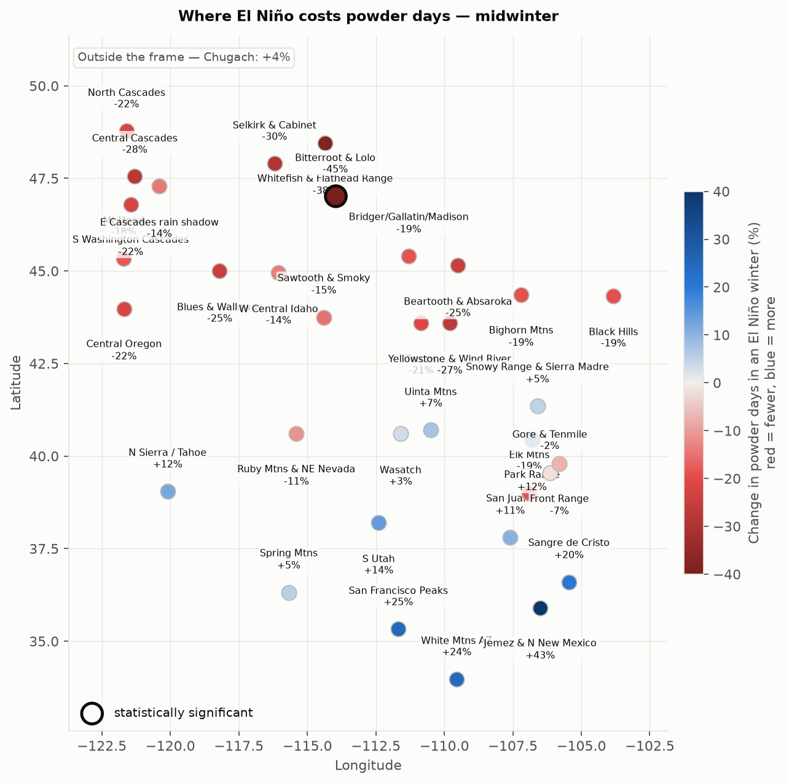
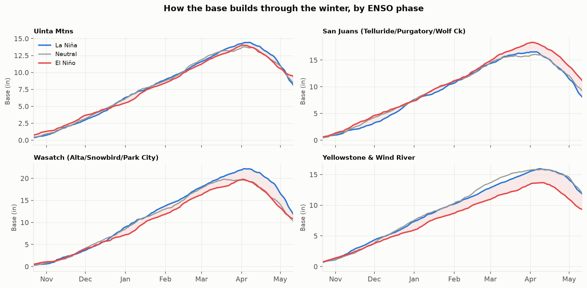
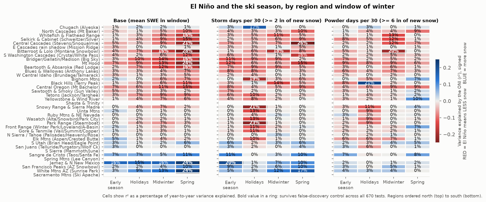
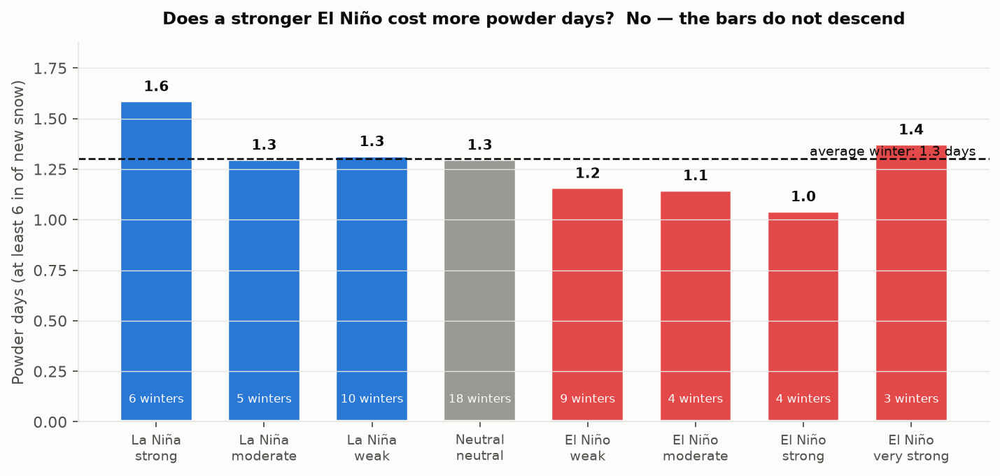
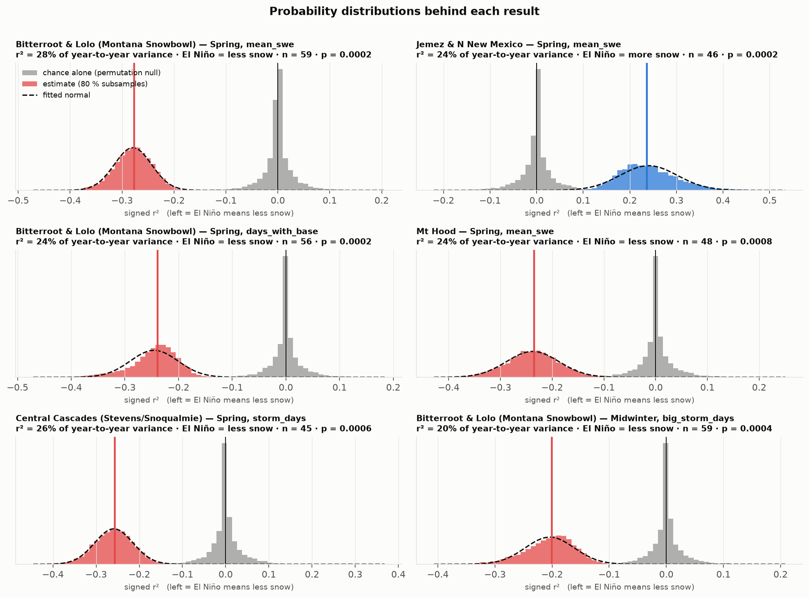
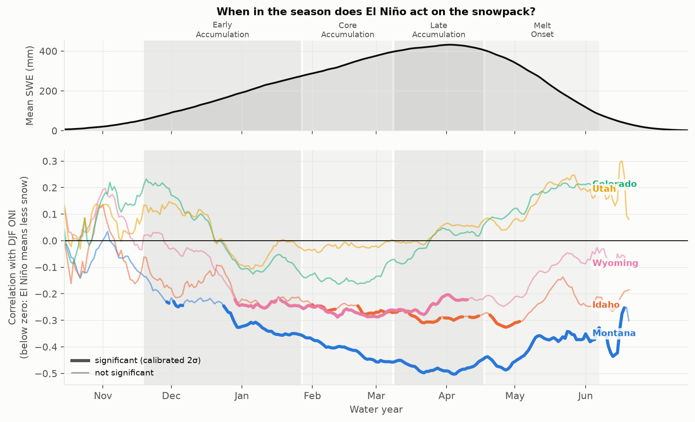

# El Niño and snowpack in Montana, Idaho, Wyoming, Colorado and Utah

_Generated 2026-09-19 by `enso_snowpack` (real data)._

## Question

Is there a correlation between El Niño strength (Oceanic Niño Index, ONI) and the winter snowpack of the five states, and how strong is it?

## Data

- ENSO: NOAA CPC ONI, water years 1950–2026; 25 El Niño winters (1952, 1958, 1959, 1964, 1966, 1969, 1973, 1977, 1978, 1980, 1983, 1987, 1988, 1992, 1995, 1998, 2003, 2005, 2007, 2010, 2015, 2016, 2019, 2020, 2024), 27 La Niña winters, 25 neutral.
- SNOTEL: 711 stations with ≥ 15 valid April-1 SWE values (of 932 in the five states), daily WTEQ / SNWD / PREC / TAVG.
- Snow courses: 910 manual courses with ≥ 15 April-1 measurements (extends the record before SNOTEL).
- Weather: NCEI nClimDiv statewide monthly precipitation and mean temperature (Nov–Mar precipitation as % of the 1991–2020 normal; DJF temperature anomaly).

Snowpack metric: April-1 snow-water equivalent per station, standardised per station (z-score of the linearly detrended series, so long-term warming trends cannot masquerade as ENSO signal), then averaged over the stations of each state for each water year. Peak SWE is analysed the same way. The ENSO index is the DJF ONI of the water year; El Niño ≥ +0.5 °C, La Niña ≤ −0.5 °C.

## ENSO classification of the water years

Phase from the DJF ONI (El Niño ≥ +0.5 °C, La Niña ≤ −0.5 °C); strength from the peak |ONI| over the OND…FMA seasons of the water year, in the CPC bins weak 0.5–0.9, moderate 1.0–1.4, strong 1.5–1.9, very strong ≥ 2.0. The value in parentheses is the DJF ONI.

| Phase | Strength (winter peak ONI) | n | Water years (DJF ONI) |
|---|---|---|---|
| El Nino | very strong | 3 | 1983 (+2.1), 1998 (+2.2), 2016 (+2.5) |
| El Nino | strong | 6 | 1958 (+1.7), 1966 (+1.2), 1973 (+1.6), 1992 (+1.5), 2010 (+1.5), 2024 (+1.8) |
| El Nino | moderate | 5 | 1964 (+0.9), 1987 (+1.2), 1988 (+0.6), 2003 (+0.9), 2019 (+1.0) |
| El Nino | weak | 11 | 1952 (+0.5), 1959 (+0.6), 1969 (+1.0), 1977 (+0.7), 1978 (+0.7), 1980 (+0.6), 1995 (+0.9), 2005 (+0.6), 2007 (+0.6), 2015 (+0.7), 2020 (+0.7) |
| Neutral | neutral | 25 | 1953 (+0.2), 1954 (+0.4), 1957 (-0.3), 1960 (+0.0), 1961 (+0.0), 1962 (-0.2), 1963 (-0.3), 1967 (-0.5), 1970 (+0.5), 1979 (+0.2), 1981 (-0.3), 1982 (-0.1), 1986 (-0.4), 1990 (+0.2), 1991 (+0.3), 1993 (+0.1), 1994 (+0.1), 1997 (-0.4), 2002 (-0.1), 2004 (+0.3), 2013 (-0.2), 2014 (-0.2), 2017 (-0.1), 2025 (-0.5), 2026 (-0.4) |
| La Nina | weak | 13 | 1951 (-0.7), 1955 (-0.5), 1965 (-0.5), 1968 (-0.6), 1972 (-0.6), 1975 (-0.6), 1984 (-0.6), 2001 (-0.8), 2006 (-0.9), 2009 (-0.9), 2018 (-0.7), 2022 (-0.8), 2023 (-0.6) |
| La Nina | moderate | 6 | 1950 (-1.3), 1971 (-1.3), 1985 (-1.0), 1996 (-0.9), 2012 (-0.7), 2021 (-1.0) |
| La Nina | strong | 7 | 1956 (-1.2), 1976 (-1.5), 1989 (-1.6), 1999 (-1.5), 2000 (-1.5), 2008 (-1.8), 2011 (-1.3) |
| La Nina | very strong | 1 | 1974 (-1.9) |

## The numbers, in days and inches

These are actual averages over the record, not anomalies: what a normal winter delivers, what an El Niño winter delivered, and the difference.

**Powder days in the midwinter window** (days with at least 25 mm of new snow water, roughly 25–40 cm of snow):

| Ski region | winters | a normal winter | an El Niño winter | change | a La Niña winter | change |
|---|---|---|---|---|---|---|
| Bitterroot & Lolo (Montana Snowbowl) | 59 | 1.5 d | **0.8 d** | -0.7 d (-45 %) | 2.0 d | +0.5 d (+35 %) |
| Whitefish & Flathead Range | 52 | 1.5 d | **1.0 d** | -0.6 d (-38 %) | 2.0 d | +0.5 d (+32 %) |
| Selkirk & Cabinet (Schweitzer/Silver) | 46 | 2.5 d | **1.8 d** | -0.7 d (-30 %) | 3.2 d | +0.7 d (+26 %) |
| Central Cascades (Stevens/Snoqualmie) | 45 | 3.7 d | **2.6 d** | -1.0 d (-28 %) | 4.4 d | +0.7 d (+19 %) |
| Yellowstone & Wind River | 48 | 1.0 d | **0.7 d** | -0.3 d (-27 %) | 0.8 d | -0.2 d (-16 %) |
| Beartooth & Absaroka (Red Lodge) | 53 | 1.2 d | **0.9 d** | -0.3 d (-25 %) | 1.5 d | +0.3 d (+24 %) |
| Blues & Wallowas (Anthony Lakes) | 48 | 0.8 d | **0.6 d** | -0.2 d (-25 %) | 0.9 d | +0.0 d (+4 %) |
| North Cascades (Mt Baker) | 44 | 4.6 d | **3.6 d** | -1.0 d (-22 %) | 5.1 d | +0.5 d (+12 %) |
| S Washington Cascades (Crystal/White Pass) | 45 | 3.9 d | **3.1 d** | -0.9 d (-22 %) | 4.3 d | +0.3 d (+9 %) |
| Central Oregon (Mt Bachelor) | 46 | 3.4 d | **2.6 d** | -0.7 d (-22 %) | 4.2 d | +0.9 d (+25 %) |
| Tetons (Jackson/Targhee) | 46 | 1.8 d | **1.4 d** | -0.4 d (-21 %) | 1.6 d | -0.1 d (-8 %) |
| Black Hills (Terry Peak) | 26 | 0.2 d | **0.2 d** | -0.0 d (-19 %) | 0.3 d | +0.1 d (+50 %) |
| Bighorn Mtns | 48 | 0.4 d | **0.3 d** | -0.1 d (-19 %) | 0.5 d | +0.1 d (+16 %) |
| Bridger/Gallatin/Madison (Big Sky) | 60 | 1.0 d | **0.8 d** | -0.2 d (-19 %) | 1.0 d | +0.1 d (+7 %) |
| Elk Mtns (Aspen/Crested Butte) | 46 | 1.3 d | **1.1 d** | -0.2 d (-19 %) | 1.5 d | +0.2 d (+12 %) |
| Mt Hood | 48 | 3.9 d | **3.1 d** | -0.7 d (-18 %) | 4.7 d | +0.8 d (+21 %) |
| Sawtooth & Smoky (Sun Valley) | 46 | 1.4 d | **1.2 d** | -0.2 d (-15 %) | 1.3 d | -0.2 d (-13 %) |
| E Cascades rain shadow (Mission Ridge) | 45 | 1.2 d | **1.1 d** | -0.2 d (-14 %) | 1.5 d | +0.3 d (+21 %) |
| W Central Idaho (Brundage/Tamarack) | 46 | 2.2 d | **1.9 d** | -0.3 d (-14 %) | 2.3 d | +0.1 d (+3 %) |
| Ruby Mtns & NE Nevada | 46 | 1.3 d | **1.2 d** | -0.1 d (-11 %) | 1.4 d | +0.0 d (+4 %) |
| Front Range (Winter Park/Loveland/A-Basin) | 48 | 0.8 d | **0.8 d** | -0.1 d (-7 %) | 0.8 d | +0.0 d (+1 %) |
| Gore & Tenmile (Vail/Summit/Copper) | 48 | 0.8 d | **0.8 d** | -0.0 d (-2 %) | 0.8 d | +0.0 d (+4 %) |
| Wasatch (Alta/Snowbird/Park City) | 48 | 2.5 d | **2.5 d** | +0.1 d (+3 %) | 2.4 d | -0.1 d (-2 %) |
| Chugach (Alyeska) | 43 | 3.1 d | **3.2 d** | +0.1 d (+4 %) | 3.1 d | +0.0 d (+1 %) |
| Snowy Range & Sierra Madre | 46 | 1.7 d | **1.8 d** | +0.1 d (+5 %) | 1.7 d | -0.1 d (-3 %) |
| Spring Mtns (Lee Canyon) | 18 | 1.5 d | **1.6 d** | +0.1 d (+5 %) | 1.3 d | -0.2 d (-15 %) |
| Uinta Mtns | 48 | 1.3 d | **1.4 d** | +0.1 d (+7 %) | 1.1 d | -0.2 d (-13 %) |
| San Juans (Telluride/Purgatory/Wolf Ck) | 47 | 2.2 d | **2.4 d** | +0.2 d (+11 %) | 2.2 d | -0.0 d (-1 %) |
| Park Range (Steamboat) | 47 | 2.1 d | **2.3 d** | +0.3 d (+12 %) | 2.1 d | -0.0 d (-1 %) |
| N Sierra / Tahoe (Palisades/Heavenly/Rose) | 48 | 4.3 d | **4.8 d** | +0.5 d (+12 %) | 4.1 d | -0.2 d (-4 %) |
| S Utah (Brian Head/Eagle Point) | 48 | 1.7 d | **1.9 d** | +0.2 d (+14 %) | 1.5 d | -0.2 d (-14 %) |
| Sangre de Cristo (Taos/Santa Fe) | 47 | 0.9 d | **1.0 d** | +0.2 d (+20 %) | 0.7 d | -0.1 d (-17 %) |
| White Mtns AZ (Sunrise Park) | 46 | 0.9 d | **1.1 d** | +0.2 d (+24 %) | 0.6 d | -0.3 d (-38 %) |
| San Francisco Peaks (AZ Snowbowl) | 46 | 1.7 d | **2.1 d** | +0.4 d (+25 %) | 1.4 d | -0.3 d (-16 %) |
| Jemez & N New Mexico | 46 | 0.7 d | **1.0 d** | +0.3 d (+43 %) | 0.7 d | -0.1 d (-7 %) |

## The ski season: by region and window of winter

Skiing is not water supply. What matters is the base underfoot and how often it storms during the windows that carry a season, so this section scores destination ski regions (not states, which are not snow climates) inside ski windows, and controls the false-discovery rate across the whole grid, because asking this many questions at p<0.05 buys false positives for free.

| Window of winter | tests | leaning to less snow | mean r | sign-test p |
|---|---|---|---|---|
| Early season | 102 | 71 (70%) | -0.06 | 0.0001*** |
| Holidays | 102 | 85 (83%) | -0.13 | 0.0000*** |
| Midwinter | 102 | 76 (75%) | -0.11 | 0.0000*** |
| Spring | 102 | 65 (64%) | -0.07 | 0.0072** |

A negative correlation means El Niño winters bring less of that quantity. The sign test asks whether the direction is consistent across independent ski regions, which is the question that matters when each single correlation is modest.

**24 of 670 tests survive false-discovery control at alpha = 0.10.** Each row is a real, sub-seasonal relationship:

| Ski region | Window | What | winters | r² (variance explained) | El Niño brings | mean z, El Niño | mean z, La Niña |
|---|---|---|---|---|---|---|---|
| Selkirk & Cabinet (Schweitzer/Silver) | Spring | Base (mean snow depth) | 25 | **34%** | less snow | -0.69 | +0.71 |
| Whitefish & Flathead Range | Spring | Base (mean snow depth) | 25 | **34%** | less snow | -0.68 | +0.62 |
| Bitterroot & Lolo (Montana Snowbowl) | Spring | Base (mean SWE in window) | 59 | **28%** | less snow | -0.58 | +0.55 |
| Central Cascades (Stevens/Snoqualmie) | Spring | Storm days per 30 (>= 2 in of new snow) | 45 | **26%** | less snow | -0.54 | +0.41 |
| White Mtns AZ (Sunrise Park) | Spring | Base (mean SWE in window) | 46 | **24%** | more snow | +0.56 | -0.36 |
| Bitterroot & Lolo (Montana Snowbowl) | Spring | Days per 30 with a skiable base | 56 | **24%** | less snow | -0.49 | +0.43 |
| Jemez & N New Mexico | Spring | Base (mean SWE in window) | 46 | **24%** | more snow | +0.65 | -0.26 |
| Mt Hood | Spring | Base (mean SWE in window) | 48 | **24%** | less snow | -0.55 | +0.59 |
| Park Range (Steamboat) | Holidays | Storm days per 30 (>= 2 in of new snow) | 47 | **23%** | less snow | -0.58 | +0.40 |
| Snowy Range & Sierra Madre | Holidays | Storm days per 30 (>= 2 in of new snow) | 46 | **21%** | less snow | -0.49 | +0.42 |
| Central Cascades (Stevens/Snoqualmie) | Spring | Base (mean SWE in window) | 45 | **21%** | less snow | -0.55 | +0.40 |
| Jemez & N New Mexico | Early season | Storm days per 30 (>= 2 in of new snow) | 46 | **20%** | more snow | +0.49 | -0.28 |
| Jemez & N New Mexico | Spring | Days per 30 with a skiable base | 46 | **20%** | more snow | +0.57 | -0.26 |
| Bitterroot & Lolo (Montana Snowbowl) | Midwinter | Powder days per 30 (>= 6 in of new snow) | 59 | **20%** | less snow | -0.45 | +0.46 |
| Bighorn Mtns | Holidays | Storm days per 30 (>= 2 in of new snow) | 48 | **19%** | less snow | -0.48 | +0.23 |
| Whitefish & Flathead Range | Spring | Days per 30 with a skiable base | 50 | **18%** | less snow | -0.49 | +0.43 |
| White Mtns AZ (Sunrise Park) | Spring | Days per 30 with a skiable base | 46 | **18%** | more snow | +0.47 | -0.27 |
| Bitterroot & Lolo (Montana Snowbowl) | Midwinter | Storm days per 30 (>= 2 in of new snow) | 59 | **18%** | less snow | -0.46 | +0.40 |
| Beartooth & Absaroka (Red Lodge) | Spring | Base (mean SWE in window) | 53 | **16%** | less snow | -0.40 | +0.35 |
| Whitefish & Flathead Range | Spring | Base (mean SWE in window) | 52 | **16%** | less snow | -0.55 | +0.34 |
| Bridger/Gallatin/Madison (Big Sky) | Spring | Base (mean SWE in window) | 60 | **16%** | less snow | -0.39 | +0.39 |
| Bitterroot & Lolo (Montana Snowbowl) | Midwinter | Base (mean SWE in window) | 59 | **16%** | less snow | -0.42 | +0.46 |
| Bitterroot & Lolo (Montana Snowbowl) | Midwinter | Days per 30 with a skiable base | 59 | **15%** | less snow | -0.37 | +0.38 |
| Bridger/Gallatin/Madison (Big Sky) | Midwinter | Days per 30 with a skiable base | 60 | **13%** | less snow | -0.32 | +0.33 |

### Does the STRENGTH of the event matter?

Phase means which of El Niño / Neutral / La Niña a winter is. Strength means how far the ONI actually went. `change from adding strength` is the variance explained by the continuous index minus the variance explained by phase alone: at or below zero, knowing the magnitude adds nothing and a strong El Niño is no worse for skiing than a weak one.

| Window | r² from phase alone | r² from the continuous ONI | change from adding strength | tests where strength helps | r² within El Niño winters only |
|---|---|---|---|---|---|
| Early season | 6.0% | 3.9% | **-2.2%** | 16 of 164 | 4.7% |
| Holidays | 7.2% | 4.7% | **-2.6%** | 6 of 167 | 6.9% |
| Midwinter | 7.0% | 5.6% | **-1.4%** | 26 of 169 | 7.2% |
| Spring | 10.3% | 6.7% | **-3.6%** | 21 of 170 | 7.2% |

## When in the season the signal acts

April-1 SWE is one snapshot and it mixes accumulation with melt already under way, so it cannot show *when* ENSO acts. Following Brown & Harper (2026), the correlation is computed for **every day of the water year** and summarised over their four seasonal periods. This is the primary result; the April-1 tables below are the conventional cross-section of it.

| State | Period | days | mean r | range | days significant | mean z, El Niño | mean z, La Niña |
|---|---|---|---|---|---|---|---|
| Montana | Early Accumulation | 70 | -0.27 | -0.36 to -0.13 | 60% | -0.21 | +0.25 |
|  | Core Accumulation | 40 | -0.41 | -0.46 to -0.36 | 100% | -0.37 | +0.39 |
|  | Late Accumulation | 40 | -0.48 | -0.50 to -0.45 | 100% | -0.45 | +0.44 |
|  | Melt Onset | 51 | -0.40 | -0.49 to -0.33 | 100% | -0.40 | +0.37 |
| Idaho | Early Accumulation | 70 | -0.18 | -0.25 to -0.06 | 3% | -0.19 | +0.20 |
|  | Core Accumulation | 40 | -0.26 | -0.28 to -0.23 | 70% | -0.31 | +0.20 |
|  | Late Accumulation | 40 | -0.29 | -0.31 to -0.26 | 82% | -0.34 | +0.30 |
|  | Melt Onset | 51 | -0.25 | -0.33 to -0.14 | 29% | -0.25 | +0.29 |
| Wyoming | Early Accumulation | 70 | -0.13 | -0.25 to +0.03 | 41% | -0.17 | +0.09 |
|  | Core Accumulation | 40 | -0.27 | -0.29 to -0.24 | 100% | -0.30 | +0.14 |
|  | Late Accumulation | 40 | -0.24 | -0.28 to -0.20 | 82% | -0.27 | +0.15 |
|  | Melt Onset | 51 | -0.14 | -0.25 to -0.03 | 2% | -0.16 | +0.14 |
| Colorado | Early Accumulation | 70 | +0.02 | -0.13 to +0.23 | 0% | +0.07 | +0.04 |
|  | Core Accumulation | 40 | -0.14 | -0.16 to -0.07 | 0% | -0.03 | +0.16 |
|  | Late Accumulation | 40 | -0.00 | -0.09 to +0.06 | 0% | +0.11 | +0.11 |
|  | Melt Onset | 51 | +0.16 | +0.07 to +0.22 | 0% | +0.25 | -0.03 |
| Utah | Early Accumulation | 70 | +0.02 | -0.11 to +0.15 | 0% | +0.02 | +0.02 |
|  | Core Accumulation | 40 | -0.02 | -0.04 to +0.00 | 0% | -0.00 | +0.08 |
|  | Late Accumulation | 40 | +0.03 | -0.02 to +0.07 | 0% | +0.06 | +0.12 |
|  | Melt Onset | 51 | +0.15 | +0.04 to +0.25 | 0% | +0.18 | +0.03 |

## Headline: correlation of April-1 SWE anomaly with DJF ONI

| Region | n | Pearson r [95% CI] | p | Spearman ρ | slope per +1 °C ONI | mean El Niño / Neutral / La Niña (n) | Welch p (El Niño vs rest) | r within El Niño (n) | reading |
|---|---|---|---|---|---|---|---|---|---|
| MT | 60 | -0.49 [-0.64, -0.34] | 0.000*** | -0.50 | -0.37 ± 0.09 | -0.44 / +0.08 / +0.46 (20/18/22) | 0.000 | -0.01 (20) | moderate: El Niño winters tend to be drier |
| ID | 46 | -0.29 [-0.54, -0.02] | 0.051 | -0.36 | -0.22 ± 0.11 | -0.34 / -0.00 / +0.32 (15/15/16) | 0.048 | +0.39 (15) | no significant linear relation |
| WY | 48 | -0.20 [-0.40, -0.01] | 0.165 | -0.24 | -0.15 ± 0.10 | -0.21 / +0.02 / +0.15 (16/16/16) | 0.112 | +0.25 (16) | no significant linear relation |
| CO | 48 | +0.04 [-0.18, +0.24] | 0.793 | -0.02 | +0.03 ± 0.11 | +0.16 / -0.21 / +0.13 (16/16/16) | 0.311 | -0.02 (16) | no significant linear relation |
| UT | 48 | +0.05 [-0.19, +0.30] | 0.713 | +0.04 | +0.04 ± 0.12 | +0.10 / -0.19 / +0.14 (16/16/16) | 0.615 | +0.18 (16) | no significant linear relation |
| North (MT+ID) | 60 | -0.47 [-0.64, -0.29] | 0.000*** | -0.49 | -0.35 ± 0.09 | -0.41 / +0.08 / +0.47 (20/18/22) | 0.000 | +0.16 (20) | moderate: El Niño winters tend to be drier |
| South (CO+UT) | 48 | +0.05 [-0.18, +0.27] | 0.733 | +0.02 | +0.04 ± 0.11 | +0.14 / -0.20 / +0.13 (16/16/16) | 0.425 | +0.11 (16) | no significant linear relation |
| ALL | 60 | -0.36 [-0.56, -0.16] | 0.004** | -0.40 | -0.23 ± 0.08 | -0.21 / -0.03 / +0.41 (20/18/22) | 0.015 | +0.21 (20) | moderate: El Niño winters tend to be drier |

`slope` is in station-z units per °C of ONI. `r within El Niño` is the correlation using El Niño winters only — this is the direct test of whether *stronger* events matter more. Stars: * p<0.05, ** p<0.01, *** p<0.001.

### Per-station correlations (April-1 SWE)

| State | stations | median r | share r<0 | p<0.05 negative | p<0.05 positive | FDR-significant (α=0.10) |
|---|---|---|---|---|---|---|
| Alaska | 35 | -0.13 | 77% | 2 | 1 | 0 |
| Arizona | 7 | +0.29 | 0% | 0 | 3 | 3 |
| California | 29 | +0.03 | 38% | 0 | 0 | 0 |
| Colorado | 110 | +0.04 | 44% | 0 | 4 | 3 |
| Idaho | 76 | -0.20 | 100% | 21 | 0 | 16 |
| Montana | 90 | -0.38 | 98% | 61 | 0 | 53 |
| New Mexico | 17 | +0.34 | 0% | 0 | 8 | 7 |
| Nevada | 31 | -0.01 | 52% | 0 | 0 | 0 |
| Oregon | 62 | -0.28 | 94% | 28 | 0 | 22 |
| South Dakota | 2 | -0.16 | 100% | 0 | 0 | 0 |
| Utah | 102 | +0.01 | 48% | 0 | 6 | 5 |
| Washington | 63 | -0.35 | 98% | 36 | 0 | 29 |
| Wyoming | 87 | -0.21 | 80% | 20 | 3 | 12 |

## Resampling significance (April-1 SWE, scheme `brown_harper_2026`)

Brown & Harper (2026) modified bootstrap regression: a random 20 % of the water years is omitted, the regression of snowpack anomaly on DJF ONI is fitted to the remaining 80 %, and this is repeated 10 000 times; the coefficient distribution is near-Gaussian and the relation is significant only where its 2σ bounds exclude zero. The `calibrated 2σ` column rescales σ by the delete-d jackknife factor sqrt((n−d)/d) (= 2 for 80/20), which turns the subsample spread into a full-sample standard error; the raw 2σ rule flags ~30 % of pure-noise cases, the calibrated one ~5 %. The permutation p shuffles the ENSO index across years as an independent check. These, not the parametric p-values above, are the significance test to quote.

| Region | n | slope per +1 °C ONI: mean ± σ | 2σ bounds | significant (2σ) | significant (calibrated 2σ) | r: mean ± σ | 2σ bounds | significant (2σ) | El Niño − rest (z): mean ± σ | significant (2σ) | permutation p (r) |
|---|---|---|---|---|---|---|---|---|---|---|---|
| MT | 60 | -0.37 ± 0.04 | [-0.45, -0.30] | **yes** | **yes** | -0.49 ± 0.04 | [-0.57, -0.42] | **yes** | -0.73 ± 0.09 | **yes** | 0.0002*** |
| ID | 46 | -0.23 ± 0.06 | [-0.35, -0.11] | **yes** | no | -0.29 ± 0.07 | [-0.43, -0.15] | **yes** | -0.50 ± 0.12 | **yes** | 0.0438* |
| WY | 48 | -0.15 ± 0.04 | [-0.23, -0.07] | **yes** | no | -0.20 ± 0.05 | [-0.30, -0.10] | **yes** | -0.30 ± 0.10 | **yes** | 0.1664 |
| CO | 48 | +0.03 ± 0.04 | [-0.05, +0.11] | no | no | +0.04 ± 0.06 | [-0.07, +0.15] | no | +0.20 ± 0.10 | no | 0.7920 |
| UT | 48 | +0.04 ± 0.05 | [-0.06, +0.14] | no | no | +0.06 ± 0.07 | [-0.07, +0.19] | no | +0.13 ± 0.13 | no | 0.7097 |
| North (MT+ID) | 60 | -0.35 ± 0.04 | [-0.43, -0.26] | **yes** | **yes** | -0.47 ± 0.05 | [-0.56, -0.38] | **yes** | -0.70 ± 0.09 | **yes** | 0.0002*** |
| South (CO+UT) | 48 | +0.04 ± 0.04 | [-0.05, +0.12] | no | no | +0.05 ± 0.06 | [-0.07, +0.17] | no | +0.17 ± 0.11 | no | 0.7195 |
| ALL | 60 | -0.23 ± 0.04 | [-0.31, -0.15] | **yes** | **yes** | -0.36 ± 0.05 | [-0.47, -0.26] | **yes** | -0.42 ± 0.09 | **yes** | 0.0034** |

## Peak SWE

| Region | n | Pearson r [95% CI] | p | Spearman ρ | slope per +1 °C ONI | mean El Niño / Neutral / La Niña (n) | Welch p (El Niño vs rest) | r within El Niño (n) | reading |
|---|---|---|---|---|---|---|---|---|---|
| MT | 60 | -0.48 [-0.62, -0.33] | 0.000*** | -0.49 | -0.37 ± 0.09 | -0.48 / +0.15 / +0.45 (20/18/22) | 0.000 | -0.09 (20) | moderate: El Niño winters tend to be drier |
| ID | 46 | -0.28 [-0.53, -0.03] | 0.056 | -0.36 | -0.22 ± 0.11 | -0.35 / +0.08 / +0.30 (15/15/16) | 0.029 | +0.39 (15) | no significant linear relation |
| WY | 48 | -0.25 [-0.45, -0.03] | 0.089 | -0.26 | -0.18 ± 0.10 | -0.31 / +0.07 / +0.18 (16/16/16) | 0.027 | +0.31 (16) | no significant linear relation |
| CO | 48 | +0.00 [-0.22, +0.21] | 0.984 | -0.03 | +0.00 ± 0.11 | +0.10 / -0.16 / +0.12 (16/16/16) | 0.532 | +0.02 (16) | no significant linear relation |
| UT | 48 | +0.04 [-0.22, +0.30] | 0.795 | -0.00 | +0.03 ± 0.11 | +0.05 / -0.13 / +0.12 (16/16/16) | 0.806 | +0.21 (16) | no significant linear relation |
| North (MT+ID) | 60 | -0.46 [-0.62, -0.30] | 0.000*** | -0.48 | -0.35 ± 0.09 | -0.44 / +0.16 / +0.46 (20/18/22) | 0.000 | +0.12 (20) | moderate: El Niño winters tend to be drier |
| South (CO+UT) | 48 | +0.02 [-0.22, +0.26] | 0.872 | -0.03 | +0.02 ± 0.11 | +0.08 / -0.15 / +0.12 (16/16/16) | 0.649 | +0.14 (16) | no significant linear relation |
| ALL | 60 | -0.35 [-0.54, -0.14] | 0.006** | -0.38 | -0.23 ± 0.08 | -0.24 / +0.03 / +0.41 (20/18/22) | 0.007 | +0.24 (20) | moderate: El Niño winters tend to be drier |

## By phase and event strength (April-1 SWE, state means)

### MT

| Phase | Strength | n | mean | median | sd |
|---|---|---|---|---|---|
| La Nina | very strong | 1 | +1.29 | +1.29 | — |
| La Nina | strong | 6 | +0.58 | +0.69 | 0.45 |
| La Nina | moderate | 5 | +0.46 | +0.35 | 0.61 |
| La Nina | weak | 10 | +0.30 | +0.50 | 0.84 |
| Neutral | neutral | 18 | +0.08 | -0.05 | 0.87 |
| El Nino | very strong | 3 | -0.22 | -0.09 | 0.32 |
| El Nino | strong | 4 | -0.85 | -0.85 | 0.14 |
| El Nino | moderate | 4 | -0.31 | -0.26 | 0.54 |
| El Nino | weak | 9 | -0.39 | -0.12 | 0.63 |

### ID

| Phase | Strength | n | mean | median | sd |
|---|---|---|---|---|---|
| La Nina | strong | 5 | +0.69 | +0.79 | 0.41 |
| La Nina | moderate | 4 | +0.18 | +0.24 | 0.21 |
| La Nina | weak | 7 | +0.13 | +0.23 | 0.92 |
| Neutral | neutral | 15 | -0.00 | +0.05 | 0.92 |
| El Nino | very strong | 3 | +0.39 | +0.25 | 0.75 |
| El Nino | strong | 3 | -0.69 | -0.74 | 0.69 |
| El Nino | moderate | 4 | -0.41 | -0.47 | 0.69 |
| El Nino | weak | 5 | -0.50 | -0.80 | 0.76 |

### WY

| Phase | Strength | n | mean | median | sd |
|---|---|---|---|---|---|
| La Nina | strong | 5 | +0.38 | +0.47 | 0.46 |
| La Nina | moderate | 4 | +0.03 | -0.25 | 0.78 |
| La Nina | weak | 7 | +0.07 | +0.30 | 0.68 |
| Neutral | neutral | 16 | +0.02 | -0.29 | 1.04 |
| El Nino | very strong | 3 | +0.13 | +0.07 | 0.21 |
| El Nino | strong | 3 | -0.48 | -0.56 | 0.42 |
| El Nino | moderate | 4 | -0.17 | -0.16 | 0.42 |
| El Nino | weak | 6 | -0.28 | -0.35 | 0.50 |

### CO

| Phase | Strength | n | mean | median | sd |
|---|---|---|---|---|---|
| La Nina | strong | 5 | +0.18 | +0.01 | 0.77 |
| La Nina | moderate | 4 | -0.09 | +0.17 | 0.88 |
| La Nina | weak | 7 | +0.21 | +0.26 | 0.62 |
| Neutral | neutral | 16 | -0.21 | -0.12 | 0.98 |
| El Nino | very strong | 3 | +0.13 | +0.26 | 0.23 |
| El Nino | strong | 3 | +0.07 | -0.05 | 0.41 |
| El Nino | moderate | 4 | +0.21 | -0.06 | 0.74 |
| El Nino | weak | 6 | +0.19 | +0.43 | 0.58 |

### UT

| Phase | Strength | n | mean | median | sd |
|---|---|---|---|---|---|
| La Nina | strong | 5 | +0.14 | -0.13 | 0.76 |
| La Nina | moderate | 4 | -0.17 | -0.01 | 0.55 |
| La Nina | weak | 7 | +0.31 | +0.05 | 1.08 |
| Neutral | neutral | 16 | -0.19 | -0.27 | 0.76 |
| El Nino | very strong | 3 | +0.49 | +0.40 | 0.41 |
| El Nino | strong | 3 | -0.03 | -0.06 | 0.87 |
| El Nino | moderate | 4 | -0.10 | -0.49 | 0.82 |
| El Nino | weak | 6 | +0.11 | +0.41 | 1.10 |

## April-1 snow depth (SNWD) anomaly vs DJF ONI

| Region | n | Pearson r [95% CI] | p | Spearman ρ | slope per +1 °C ONI | mean El Niño / Neutral / La Niña (n) | Welch p (El Niño vs rest) | r within El Niño (n) | reading |
|---|---|---|---|---|---|---|---|---|---|
| MT | 29 | -0.40 [-0.61, -0.16] | 0.030* | -0.38 | -0.29 ± 0.13 | -0.44 / -0.13 / +0.34 (10/7/12) | 0.033 | +0.03 (10) | moderate: El Niño winters tend to be drier |
| ID | 29 | -0.31 [-0.55, -0.04] | 0.105 | -0.40 | -0.22 ± 0.13 | -0.33 / -0.16 / +0.35 (10/7/12) | 0.094 | +0.34 (10) | no significant linear relation |
| WY | 28 | -0.10 [-0.37, +0.18] | 0.630 | -0.17 | -0.07 ± 0.14 | -0.07 / -0.26 / +0.13 (9/7/12) | 0.836 | +0.41 (9) | no significant linear relation |
| CO | 29 | +0.13 [-0.17, +0.39] | 0.497 | +0.07 | +0.09 ± 0.14 | +0.25 / -0.63 / +0.07 (10/7/12) | 0.121 | +0.29 (10) | no significant linear relation |
| UT | 30 | +0.06 [-0.21, +0.36] | 0.734 | +0.04 | +0.05 ± 0.14 | +0.12 / -0.31 / +0.11 (10/8/12) | 0.587 | +0.25 (10) | no significant linear relation |
| North (MT+ID) | 30 | -0.37 [-0.59, -0.14] | 0.041* | -0.38 | -0.28 ± 0.13 | -0.39 / +0.05 / +0.34 (10/8/12) | 0.028 | +0.18 (10) | moderate: El Niño winters tend to be drier |
| South (CO+UT) | 30 | +0.10 [-0.19, +0.37] | 0.615 | +0.05 | +0.07 ± 0.13 | +0.19 / -0.38 / +0.08 (10/8/12) | 0.333 | +0.27 (10) | no significant linear relation |
| ALL | 30 | -0.18 [-0.42, +0.07] | 0.330 | -0.24 | -0.11 ± 0.11 | -0.12 / -0.18 / +0.24 (10/8/12) | 0.420 | +0.33 (10) | no significant linear relation |

## April-1 bulk density (SWE / depth) anomaly vs DJF ONI

A positive r here means El Niño packs are denser for their depth (warmer, wetter snow or more mid-winter melt-refreeze).

| Region | n | Pearson r [95% CI] | p | Spearman ρ | slope per +1 °C ONI | mean El Niño / Neutral / La Niña (n) | Welch p (El Niño vs rest) | r within El Niño (n) | reading |
|---|---|---|---|---|---|---|---|---|---|
| MT | 29 | -0.02 [-0.35, +0.27] | 0.905 | -0.01 | -0.01 ± 0.12 | -0.00 / +0.28 / -0.07 (10/7/12) | 0.839 | -0.13 (10) | no significant linear relation |
| ID | 29 | +0.05 [-0.29, +0.37] | 0.783 | +0.10 | +0.04 ± 0.13 | +0.00 / +0.45 / -0.10 (10/7/12) | 0.761 | +0.17 (10) | no significant linear relation |
| WY | 28 | -0.22 [-0.54, +0.21] | 0.266 | -0.15 | -0.15 ± 0.13 | -0.25 / +0.50 / -0.02 (9/7/12) | 0.185 | -0.55 (9) | no significant linear relation |
| CO | 29 | -0.05 [-0.31, +0.26] | 0.785 | -0.01 | -0.03 ± 0.09 | -0.11 / +0.08 / -0.08 (10/7/12) | 0.668 | -0.43 (10) | no significant linear relation |
| UT | 30 | -0.01 [-0.30, +0.29] | 0.967 | +0.05 | -0.00 ± 0.11 | -0.01 / +0.11 / +0.00 (10/8/12) | 0.818 | -0.05 (10) | no significant linear relation |
| North (MT+ID) | 30 | -0.01 [-0.34, +0.29] | 0.961 | +0.05 | -0.01 ± 0.12 | +0.00 / +0.43 / -0.07 (10/8/12) | 0.671 | +0.00 (10) | no significant linear relation |
| South (CO+UT) | 30 | -0.03 [-0.28, +0.24] | 0.869 | +0.07 | -0.02 ± 0.10 | -0.04 / +0.17 / -0.03 (10/8/12) | 0.651 | -0.22 (10) | no significant linear relation |
| ALL | 30 | +0.02 [-0.27, +0.32] | 0.897 | +0.12 | +0.01 ± 0.08 | -0.00 / +0.28 / -0.06 (10/8/12) | 0.694 | -0.03 (10) | no significant linear relation |

## Sensitivity: percent-of-median instead of detrended z

| Region | n | Pearson r [95% CI] | p | Spearman ρ | slope per +1 °C ONI | mean El Niño / Neutral / La Niña (n) | Welch p (El Niño vs rest) | r within El Niño (n) | reading |
|---|---|---|---|---|---|---|---|---|---|
| MT | 60 | -0.48 [-0.63, -0.32] | 0.000*** | -0.49 | -11.87 ± 2.86 | -9.11 / +6.70 / +19.33 (20/18/22) | 0.000 | -0.11 (20) | moderate: El Niño winters tend to be drier |
| ID | 46 | -0.28 [-0.54, -0.00] | 0.063 | -0.38 | -7.95 ± 4.17 | -10.54 / +2.04 / +13.22 (15/15/16) | 0.050 | +0.40 (15) | no significant linear relation |
| WY | 48 | -0.18 [-0.38, +0.02] | 0.222 | -0.23 | -3.89 ± 3.14 | -2.74 / +3.91 / +6.97 (16/16/16) | 0.151 | +0.26 (16) | no significant linear relation |
| CO | 48 | +0.09 [-0.11, +0.28] | 0.545 | +0.05 | +2.38 ± 3.90 | +10.55 / -2.60 / +5.44 (16/16/16) | 0.211 | -0.03 (16) | no significant linear relation |
| UT | 48 | +0.11 [-0.13, +0.35] | 0.445 | +0.09 | +4.64 ± 6.02 | +17.72 / +0.02 / +13.53 (16/16/16) | 0.418 | +0.17 (16) | no significant linear relation |
| North (MT+ID) | 60 | -0.45 [-0.62, -0.26] | 0.000*** | -0.48 | -11.49 ± 3.02 | -8.44 / +6.49 / +20.25 (20/18/22) | 0.001 | +0.11 (20) | moderate: El Niño winters tend to be drier |
| South (CO+UT) | 48 | +0.11 [-0.11, +0.33] | 0.450 | +0.10 | +3.66 ± 4.81 | +14.71 / -1.03 / +9.52 (16/16/16) | 0.302 | +0.11 (16) | no significant linear relation |
| ALL | 60 | -0.27 [-0.48, -0.04] | 0.040* | -0.32 | -7.04 ± 3.36 | +1.85 / +3.94 / +22.07 (20/18/22) | 0.095 | +0.22 (20) | weak: El Niño winters tend to be drier |

## Snow courses (longer record, April-1 SWE)

| Region | n | Pearson r [95% CI] | p | Spearman ρ | slope per +1 °C ONI | mean El Niño / Neutral / La Niña (n) | Welch p (El Niño vs rest) | r within El Niño (n) | reading |
|---|---|---|---|---|---|---|---|---|---|
| MT | 77 | -0.45 [-0.58, -0.31] | 0.000*** | -0.48 | -0.34 ± 0.08 | -0.34 / -0.05 / +0.45 (25/25/27) | 0.001 | -0.16 (25) | moderate: El Niño winters tend to be drier |
| ID | 77 | -0.30 [-0.49, -0.11] | 0.008** | -0.34 | -0.24 ± 0.09 | -0.19 / -0.19 / +0.42 (25/25/27) | 0.099 | +0.16 (25) | moderate: El Niño winters tend to be drier |
| WY | 77 | -0.34 [-0.49, -0.18] | 0.002** | -0.37 | -0.24 ± 0.08 | -0.25 / -0.07 / +0.33 (25/25/27) | 0.012 | -0.11 (25) | moderate: El Niño winters tend to be drier |
| CO | 77 | +0.02 [-0.15, +0.18] | 0.851 | +0.02 | +0.02 ± 0.09 | +0.11 / -0.21 / +0.10 (25/25/27) | 0.398 | -0.06 (25) | no significant linear relation |
| UT | 77 | +0.08 [-0.12, +0.27] | 0.479 | +0.05 | +0.07 ± 0.10 | +0.15 / -0.25 / +0.09 (25/25/27) | 0.327 | +0.12 (25) | no significant linear relation |
| North (MT+ID) | 77 | -0.40 [-0.56, -0.23] | 0.000*** | -0.45 | -0.29 ± 0.08 | -0.27 / -0.11 / +0.43 (25/25/27) | 0.008 | +0.03 (25) | moderate: El Niño winters tend to be drier |
| South (CO+UT) | 77 | +0.06 [-0.13, +0.22] | 0.622 | +0.04 | +0.04 ± 0.09 | +0.13 / -0.22 / +0.08 (25/25/27) | 0.307 | +0.04 (25) | no significant linear relation |
| ALL | 77 | -0.26 [-0.44, -0.09] | 0.021* | -0.32 | -0.17 ± 0.07 | -0.13 / -0.14 / +0.29 (25/25/27) | 0.169 | +0.01 (25) | weak: El Niño winters tend to be drier |

## Weather: nClimDiv statewide Nov–Mar precipitation (% of normal) vs DJF ONI

| Region | n | Pearson r [95% CI] | p | Spearman ρ | slope per +1 °C ONI | mean El Niño / Neutral / La Niña (n) | Welch p (El Niño vs rest) | r within El Niño (n) | reading |
|---|---|---|---|---|---|---|---|---|---|
| MT | 77 | -0.41 [-0.57, -0.21] | 0.000*** | -0.39 | -8.35 ± 2.17 | -6.66 / +5.33 / +10.32 (25/25/27) | 0.003 | -0.28 (25) | moderate: El Niño winters tend to be drier |
| ID | 77 | -0.34 [-0.52, -0.13] | 0.002** | -0.37 | -7.78 ± 2.46 | -6.05 / +0.82 / +11.25 (25/25/27) | 0.022 | +0.10 (25) | moderate: El Niño winters tend to be drier |
| WY | 77 | -0.20 [-0.38, -0.03] | 0.075 | -0.22 | -3.53 ± 1.96 | -4.79 / -1.19 / +3.67 (25/25/27) | 0.116 | +0.07 (25) | no significant linear relation |
| CO | 77 | +0.20 [+0.02, +0.37] | 0.087 | +0.22 | +4.14 ± 2.39 | +7.54 / -2.73 / -1.90 (25/25/27) | 0.061 | +0.09 (25) | no significant linear relation |
| UT | 77 | +0.24 [+0.07, +0.40] | 0.038* | +0.24 | +6.88 ± 3.25 | +8.46 / -5.62 / -6.89 (25/25/27) | 0.050 | +0.10 (25) | weak: El Niño winters tend to be wetter |

## Weather: nClimDiv statewide DJF temperature anomaly (°C) vs DJF ONI

| Region | n | Pearson r [95% CI] | p | Spearman ρ | slope per +1 °C ONI | mean El Niño / Neutral / La Niña (n) | Welch p (El Niño vs rest) | r within El Niño (n) | reading |
|---|---|---|---|---|---|---|---|---|---|
| MT | 77 | +0.25 [+0.02, +0.47] | 0.027* | +0.26 | +0.58 ± 0.26 | +0.08 / -0.61 / -1.15 (25/25/27) | 0.100 | +0.41 (25) | weak: El Niño winters tend to be wetter |
| ID | 77 | +0.27 [+0.09, +0.44] | 0.019* | +0.29 | +0.42 ± 0.17 | +0.22 / -0.36 / -0.85 (25/25/27) | 0.024 | +0.15 (25) | weak: El Niño winters tend to be wetter |
| WY | 77 | +0.16 [-0.05, +0.38] | 0.160 | +0.17 | +0.26 ± 0.19 | -0.02 / -0.28 / -0.67 (25/25/27) | 0.220 | +0.27 (25) | no significant linear relation |
| CO | 77 | +0.03 [-0.19, +0.24] | 0.809 | +0.04 | +0.04 ± 0.16 | -0.31 / -0.30 / -0.49 (25/25/27) | 0.786 | +0.12 (25) | no significant linear relation |
| UT | 77 | +0.07 [-0.14, +0.28] | 0.545 | +0.06 | +0.11 ± 0.19 | -0.16 / -0.30 / -0.58 (25/25/27) | 0.471 | -0.03 (25) | no significant linear relation |

## SNOTEL Oct–Mar precipitation anomaly vs DJF ONI

| Region | n | Pearson r [95% CI] | p | Spearman ρ | slope per +1 °C ONI | mean El Niño / Neutral / La Niña (n) | Welch p (El Niño vs rest) | r within El Niño (n) | reading |
|---|---|---|---|---|---|---|---|---|---|
| MT | 48 | -0.41 [-0.60, -0.20] | 0.004** | -0.42 | -0.30 ± 0.10 | -0.45 / +0.23 / +0.22 (16/16/16) | 0.001 | -0.14 (16) | moderate: El Niño winters tend to be drier |
| ID | 46 | -0.27 [-0.51, -0.04] | 0.065 | -0.35 | -0.22 ± 0.11 | -0.37 / +0.14 / +0.20 (15/15/16) | 0.025 | +0.37 (15) | no significant linear relation |
| WY | 48 | -0.25 [-0.45, -0.05] | 0.085 | -0.27 | -0.18 ± 0.10 | -0.27 / +0.15 / +0.11 (16/16/16) | 0.030 | +0.11 (16) | no significant linear relation |
| CO | 48 | -0.02 [-0.23, +0.18] | 0.900 | -0.04 | -0.01 ± 0.10 | +0.09 / -0.14 / +0.12 (16/16/16) | 0.580 | -0.08 (16) | no significant linear relation |
| UT | 48 | +0.02 [-0.21, +0.25] | 0.895 | -0.03 | +0.02 ± 0.12 | +0.04 / -0.03 / +0.04 (16/16/16) | 0.889 | +0.06 (16) | no significant linear relation |
| North (MT+ID) | 48 | -0.36 [-0.58, -0.14] | 0.011* | -0.42 | -0.26 ± 0.10 | -0.40 / +0.20 / +0.21 (16/16/16) | 0.003 | +0.11 (16) | moderate: El Niño winters tend to be drier |
| South (CO+UT) | 48 | +0.00 [-0.22, +0.22] | 0.979 | -0.02 | +0.00 ± 0.11 | +0.07 / -0.09 / +0.08 (16/16/16) | 0.702 | +0.00 (16) | no significant linear relation |
| ALL | 48 | -0.16 [-0.39, +0.08] | 0.284 | -0.20 | -0.09 ± 0.08 | -0.12 / +0.03 / +0.11 (16/16/16) | 0.242 | +0.23 (16) | no significant linear relation |

## Sensitivity: MEI v2 (Dec–Jan) instead of ONI

| Region | n | Pearson r [95% CI] | p | Spearman ρ | slope per +1 °C ONI | mean El Niño / Neutral / La Niña (n) | Welch p (El Niño vs rest) | r within El Niño (n) | reading |
|---|---|---|---|---|---|---|---|---|---|
| MT | 48 | -0.42 [-0.61, -0.23] | 0.003** | -0.44 | -0.33 ± 0.10 | -0.42 / +0.02 / +0.30 (16/16/16) | 0.003 | +0.02 (16) | moderate: El Niño winters tend to be drier |
| ID | 46 | -0.28 [-0.57, +0.02] | 0.056 | -0.40 | -0.24 ± 0.12 | -0.34 / -0.00 / +0.32 (15/15/16) | 0.048 | +0.30 (15) | no significant linear relation |
| WY | 48 | -0.24 [-0.47, -0.02] | 0.096 | -0.30 | -0.19 ± 0.11 | -0.21 / +0.02 / +0.15 (16/16/16) | 0.112 | +0.19 (16) | no significant linear relation |
| CO | 48 | +0.02 [-0.21, +0.22] | 0.906 | -0.04 | +0.01 ± 0.12 | +0.16 / -0.21 / +0.13 (16/16/16) | 0.311 | -0.27 (16) | no significant linear relation |
| UT | 48 | -0.00 [-0.28, +0.28] | 0.990 | +0.00 | -0.00 ± 0.12 | +0.10 / -0.19 / +0.14 (16/16/16) | 0.615 | -0.03 (16) | no significant linear relation |
| North (MT+ID) | 48 | -0.38 [-0.61, -0.13] | 0.008** | -0.44 | -0.29 ± 0.10 | -0.38 / +0.01 / +0.31 (16/16/16) | 0.009 | +0.16 (16) | moderate: El Niño winters tend to be drier |
| South (CO+UT) | 48 | +0.01 [-0.24, +0.25] | 0.950 | -0.01 | +0.01 ± 0.12 | +0.14 / -0.20 / +0.13 (16/16/16) | 0.425 | -0.12 (16) | no significant linear relation |
| ALL | 48 | -0.22 [-0.48, +0.06] | 0.141 | -0.29 | -0.13 ± 0.09 | -0.13 / -0.10 / +0.24 (16/16/16) | 0.262 | +0.12 (16) | no significant linear relation |

## How to read this

- A negative r means El Niño winters have *less* snow than average (and La Niña more); a positive r the reverse. |r| of 0.3 explains about 10 % of year-to-year variance, 0.5 about 25 %.
- The 95 % CI on r is a bootstrap over water years. If it spans zero the sign is not established.
- `r within El Niño` answers the *strength* question directly but rests on few winters; treat |r| < 0.4 with n < 12 as not established.
- The nClimDiv rows use 70+ winters, so they are the most robust sign test; the SNOTEL rows use ~40 but measure the snowpack itself.

Tables: `corr_*.csv`, `station_corr_*.csv`, `regional_*.csv`, `enso_water_years.csv`.